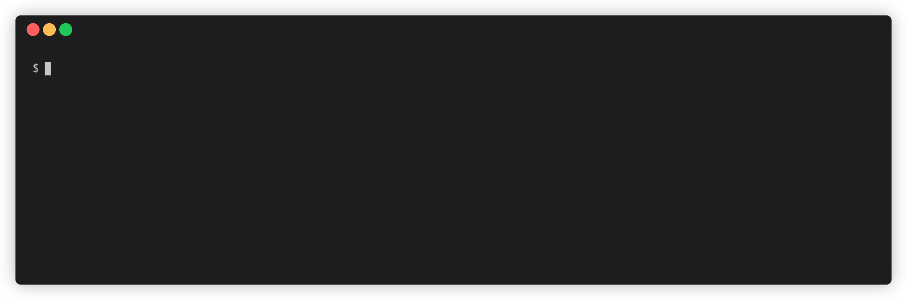

# [postman-to-openapi](https://joolfe.github.io/postman-to-openapi/)

🛸 Convert Postman Collection v2.1/v2.0 to OpenAPI v3.0.

Or in other words, transform [this specification](https://schema.getpostman.com/json/collection/v2.1.0/collection.json) and [also this](https://schema.getpostman.com/json/collection/v2.0.0/collection.json) to [this one](http://spec.openapis.org/oas/v3.0.3.html)

[](https://github.com/joolfe/postman-to-openapi/actions)
[](https://codecov.io/gh/joolfe/postman-to-openapi)
[](https://www.npmjs.com/package/postman-to-openapi)
[](http://standardjs.com)
[](https://github.com/joolfe/postman-to-openapi/actions/workflows/codeql-analysis.yml)

## Installation

Using `npm`:

```bash
npm i postman-to-openapi
```

Using `yarn`:

```bash
yarn add postman-to-openapi
```

To install as a `cli` just

```bash
npm i postman-to-openapi -g
```

## Quick Usage

As a library

```js
// Require Package
const postmanToOpenApi = require('postman-to-openapi')

// Postman Collection Path
const postmanCollection = './path/to/postman/collection.json'
// Output OpenAPI Path
const outputFile = './api/collection.yml'

// Async/await
try {
    const result = await postmanToOpenApi(postmanCollection, outputFile, { defaultTag: 'General' })
    // Without save the result in a file
    const result2 = await postmanToOpenApi(postmanCollection, null, { defaultTag: 'General' })
    console.log(`OpenAPI specs: ${result}`)
} catch (err) {
    console.log(err)
}

// Promise callback style
postmanToOpenApi(postmanCollection, outputFile, { defaultTag: 'General' })
    .then(result => {
        console.log(`OpenAPI specs: ${result}`)
    })
    .catch(err => {
        console.log(err)
    })
```

As a cli

```bash
p2o ./path/to/PostmantoCollection.json -f ./path/to/result.yml -o ./path/to/options.json
```

## Cli Demo



## Documentation

All features, usage instructions and help can be found in the [Documentation page](https://joolfe.github.io/postman-to-openapi/)

## Development

This project use for development:

- Node.js v12.x to v17.x
- [Standard JS](https://standardjs.com/) rules to maintain clean code.
- Use [Conventional Commit](https://www.conventionalcommits.org/en/v1.0.0/) for commit messages.
- Test with [mocha.js](https://mochajs.org/).

Use the scripts in `package.json`:

- `test:unit`: Run mocha unit test.
- `test`: Execute `test:lint` plus code coverage.
- `lint`: Execute standard lint to review errors in code.
- `lint:fix`: Execute standard lint and automatically fix errors.
- `changelog`: Update changelog automatically.

Steps to generate the gif demo:

- Install terminalizer `npm install -g terminalizer`
- Start a recording using `terminalizer record demo -d 'zsh'`
- Stop recording with `Ctrl+D`
- Check demo with `terminalizer play demo`
- Adjust delays in `demo.yml`, change `rows` to 15 (is the height) and anonymize terminal session.
- Generate the gif with `terminalizer render demo`

[Husky](https://www.npmjs.com/package/husky) is configured to avoid push incorrect content to git.

## Tags

`Nodejs` `Javascript` `OpenAPI` `Postman` `Newman` `Collection` `Transform` `Convert`

## License

See the [LICENSE](LICENSE.txt) file.
